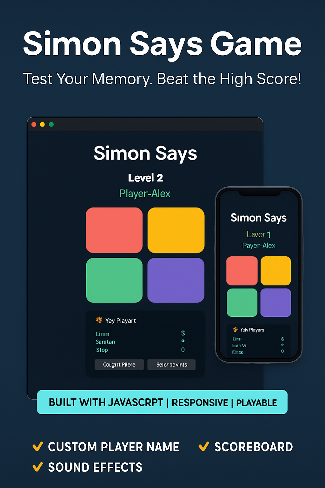

# Simon Says Game 🎮

A fully responsive and interactive **Simon Says** memory game built with **HTML, CSS, and JavaScript**, featuring custom user names, high score tracking with `localStorage`, difficulty scaling, and sound/visual effects. Inspired by the classic game, this web-based version provides an engaging experience for all ages.

## 🧠 Features

- 🎨 Interactive UI with vibrant colors & hover effects
- 🔊 Sound effects for each button
- 📱 Fully responsive for mobile & desktop
- 💾 High score tracking stored in browser (`localStorage`)
- 👤 Custom player names for high scores
- 📈 Difficulty scaling (faster levels as you progress)
- 🏆 Live scoreboard with player names
- 🚀 Built with clean, modular JavaScript

## 📸 Preview



## 🚀 Getting Started

### 1. Clone the Repository

```bash
git clone https://github.com/CodeByAlmas/simon-says-game.git
